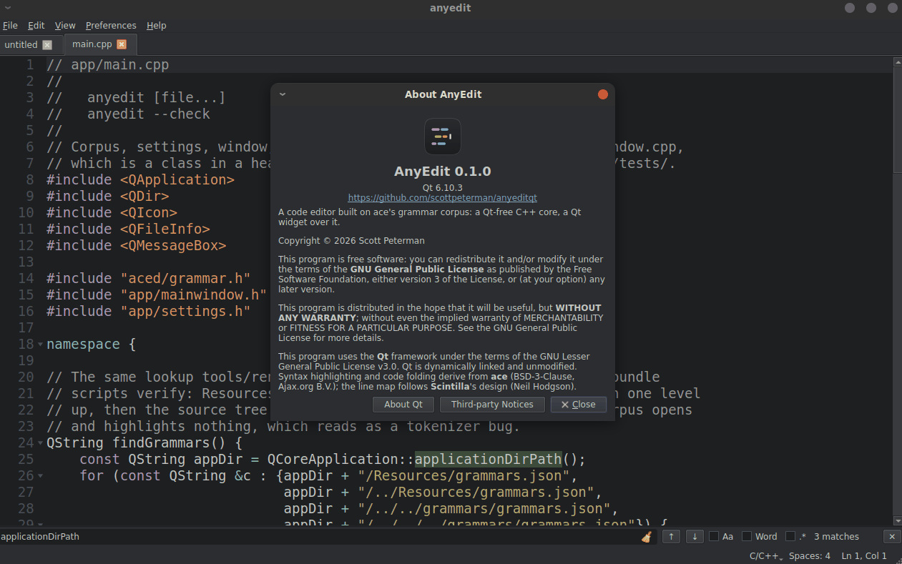
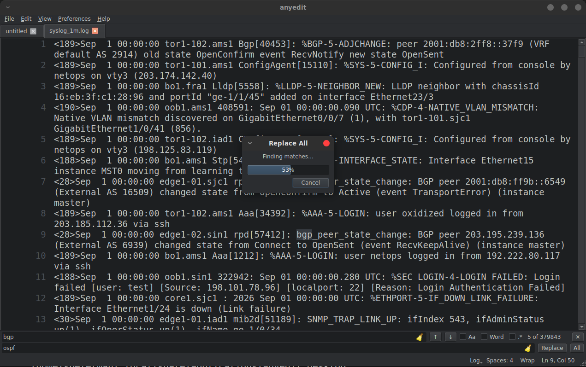
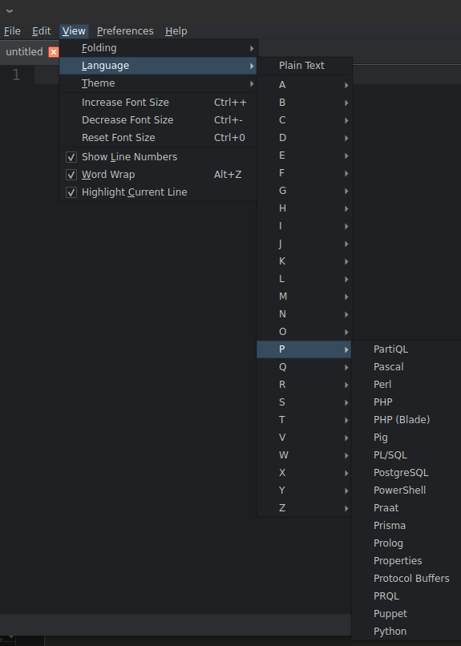
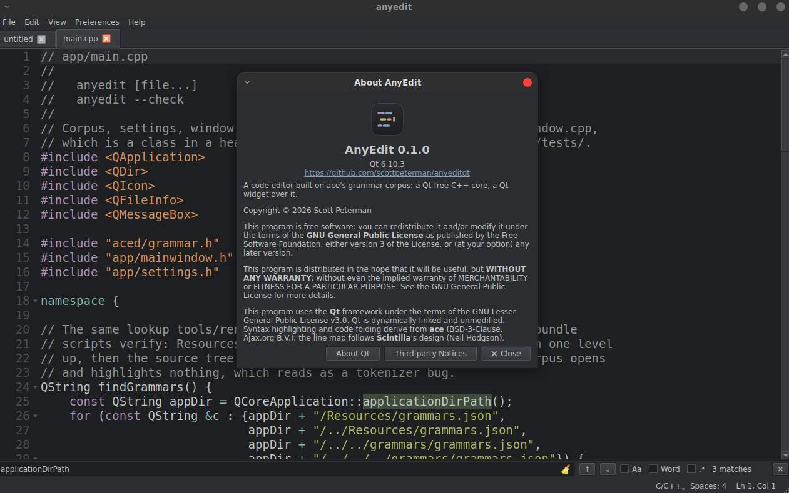
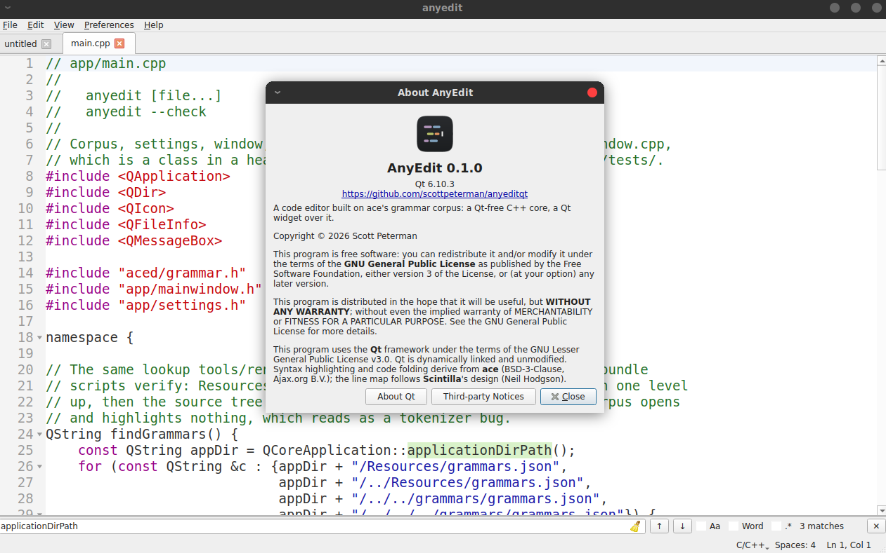
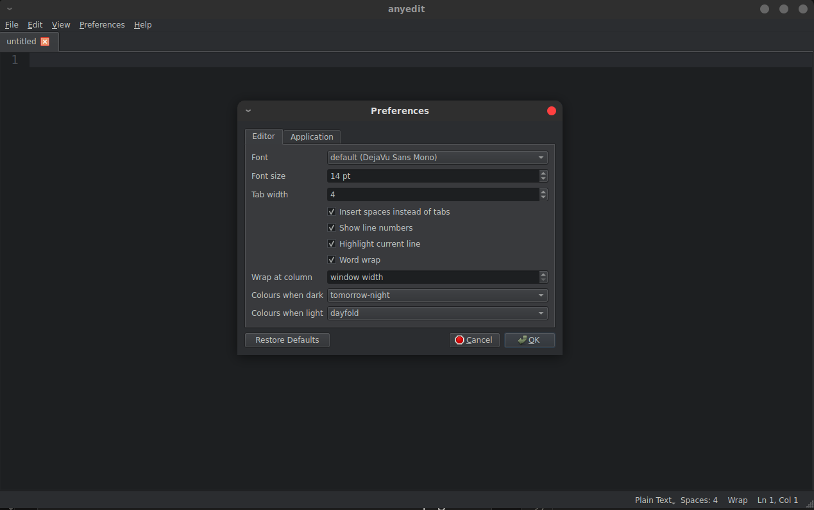
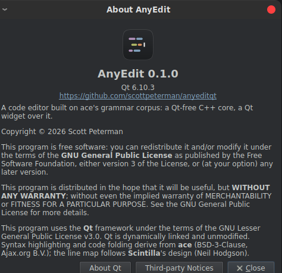

# AnyEdit

A fast, native code editor for Linux, macOS and Windows. Syntax highlighting
for 198 languages, code folding, find and replace with regex, light and dark
themes — and it stays responsive on files that choke most editors.

[](screenshots/slides.gif)

## Why AnyEdit

**Big files are normal files.** A million-line log opens almost instantly.
Scrolling, Ctrl+Home/End, paging and pasting stay immediate, with word wrap
on or off. Find counts every match, and Replace All on large files runs in
the background with a progress bar and a Cancel button — cancelling leaves
the file exactly as it was.



*A 1,000,000-line syslog file with 379,843 matches being replaced. The whole
replace takes about a second, and one Ctrl+Z undoes it.*

**198 languages out of the box.** The grammars come from the
[ace](https://github.com/ajaxorg/ace) editor, compiled to native code rather
than run in a browser. The language is picked from the file name, and you can
change it from the status bar or **View → Language**.



**Native and small.** C++ and Qt 6, no Electron, no background services, no
account. Settings are one JSON file you can read and edit.

## Screenshots

| Dark | Light |
|---|---|
|  |  |

| Preferences | About |
|---|---|
|  |  |

## Install

Download the archive for your platform from the
[Releases](https://github.com/scottpeterman/anyeditqt/releases) page.

**Linux** — `anyedit-<version>-linux-x86_64.tar.gz`. Untar anywhere and run:

```bash
tar xzf anyedit-*-linux-x86_64.tar.gz
./anyedit/bin/anyedit
```

Qt is bundled; nothing needs to be installed.

**macOS** — `anyedit-<version>-macos-arm64.zip`. Unzip and move the app to
Applications. The app is not yet signed, so the first launch may say
*"AnyEdit is damaged and can't be opened."* The download isn't damaged.
Right-click the app and choose **Open**, or clear the quarantine flag:

```bash
xattr -dr com.apple.quarantine /Applications/AnyEdit.app
```

**Windows** — `anyedit-<version>-windows-x64.zip`. Unzip and run
`anyedit.exe`. SmartScreen may warn about an unrecognised app; choose
**More info → Run anyway**.

**From source** — see [README_Building.md](README_Building.md).

## Using it

Open files from **File → Open**, the recent files list, or the command line:

```bash
anyedit path/to/file.py
```

### Editing

Typing, selection with Shift and the mouse, double-click to select a word,
cut/copy/paste, undo and redo, block indent and unindent, and tabs or spaces
per your settings. Enter carries the current indent to the next line.

### Find and replace

**Edit → Find** opens the find bar under the tabs; **Edit → Replace** adds the
replace row. The toggles are case sensitive (**Aa**), whole word (**Word**)
and regular expression (**.\***). The counter shows which match you're on and
the total — "5 of 379843".

Replacement text is literal: `$1` inserts a dollar sign and a one, not a
capture group. Replace All is a single undo step.

### Folding

Click the markers in the gutter, or use **View → Folding**. **Fold All** and
**Unfold All** are in the same menu. Editing inside a folded block opens it.
115 of the 198 languages support folding, including the C-family languages,
Python and indentation-based formats.

### Keyboard shortcuts

File, edit, find, zoom and undo/redo use your platform's standard shortcuts,
shown next to each item in the menus. The editor-specific ones:

| Action | Shortcut |
|---|---|
| Indent / unindent selection | Ctrl+] / Ctrl+[ |
| Fold / unfold | Ctrl+Shift+[ / Ctrl+Shift+] |
| Word wrap on/off | Alt+Z |
| Reset font size | Ctrl+0 |
| Settings | Ctrl+, |
| Close find bar | Esc |

On macOS, Ctrl in this table is Cmd.

## Settings

**Preferences → Settings** edits everything through a dialog. **Preferences →
Edit settings.json** opens the file itself in a tab; saving it applies the
changes immediately. The file lives at `~/.anyeditqt/settings.json`.

```json
{
  "editor": {
    "font_family": "",
    "font_size": 11,
    "tab_width": 4,
    "insert_spaces": true,
    "show_line_numbers": true,
    "highlight_current_line": true,
    "soft_wrap": false,
    "wrap_column": 0,
    "palette_dark": "tomorrow-night",
    "palette_light": "dayfold"
  },
  "app": {
    "theme": "system",
    "ui_font_family": "",
    "ui_font_size": 0,
    "window": { "remember_geometry": true }
  }
}
```

An empty `font_family` picks the best monospace font on your platform, so the
same file works on all three. `wrap_column` of 0 wraps at the window edge.
`theme` is `dark`, `light` or `system`. The recent files list is kept
separately in `~/.anyeditqt/recent.json`.

## Not there yet

So you know before you hit it:

- No multi-cursor, bracket matching, or Ctrl+Left/Right word jumps.
- Search matches within a single line; a pattern can't span lines.
- No folding for XML/HTML.
- No warning when an open file is changed on disk by another program.
- Input method composition (for CJK input, for example) shows text only once
  it's committed.
- No sidebar, command palette or fuzzy file open.

## For developers

- [README_Building.md](README_Building.md) — building on all three platforms
- [DESIGN.md](DESIGN.md) — architecture and the reasoning behind it
- [RELEASING.md](RELEASING.md) — packaging and publishing releases

## Licence

GPLv3; see `LICENSE`.

Qt is used under the LGPLv3, dynamically linked and unmodified, which LGPLv3
section 3 permits a GPLv3 work to do. That is not only a statement: the
packaging scripts deploy Qt beside the executable rather than linking it in, so
a recipient can replace it with their own build of the same version, and they
fail the package if `LICENSE`, `THIRD_PARTY_NOTICES.md` or `licenses/` is
missing from it. Conveying those with a binary is an obligation rather than a
courtesy, and a package without them looks no different from one with them.

Help → About carries the warranty disclaimer and the Qt acknowledgement, and
Help → About Qt shows The Qt Company's own notice.

## Credits

ace is BSD-3-Clause (Ajax.org B.V.). The grammar corpus in `grammars/` is
derived from ace's `mode/*_highlight_rules.js`, and `core/foldmode.cpp` from its
`mode/folding/`; both carry that licence. See `grammars/README.md` for how the
corpus is produced.

`core/linemap.cpp` follows the design of Scintilla's `ContractionState` and
`Partitioning`, Copyright 1998-2007 Neil Hodgson, under Scintilla's
attribution-only licence. The code is written here, not copied, but the
algorithm is Scintilla's. Nothing is taken from QScintilla's Qt wrapper, which
is GPLv3.

PCRE2 is BSD-3-Clause and nlohmann/json is MIT, both fetched at a pinned tag and
linked statically. `THIRD_PARTY_NOTICES.md` has the full texts;
`app/tests/test_notices.cpp` fails the build if the versions it names stop
matching the pins in `core/CMakeLists.txt`.